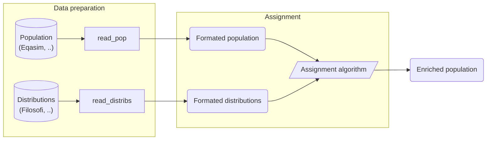

# Bhepop2

A common problem in **generating a representative synthetic population** is that not all attributes of interest are present in the sample.  The purpose is to enrich the synthetic population with additional attributes, after the synthetic population is generated from the original sample.

In many cases, practitioners only have access to aggregated data for important socio-demographic attributes, such as income, education level. 

This package treats the problem to **enrich an initial synthetic population from an aggregated data** provided in the form of a distribution like deciles or quartiles.



## Getting started

The Bhepop2 package is available on [PyPI](https://pypi.org/project/bhepop2/)

```bash
pip install bhepop2
```

## Example

TODO : link to example notebook

## Documentation

The documentation is hosted on ReadtheDocs : <https://bhepop2.readthedocs.io/en/latest/>

## Contributing

Feedback and contributions to Bhepop2 are very welcome, see [CONTRIBUTING.md](CONTRIBUTING.md) for more information !

## License

This project is licensed under the CeCILL-B License - see the [LICENSE.txt](LICENSE.txt) file for details

## Authors

This package is the product of the joint work of the Gustave Eiffel university and the company Tellae.

It is based on a methodology called Bhepop2 (Bayesian Heuristic to Enrich POPulation by EntroPy OPtimization) and theoritically described, justified and discussed in 

* Boyam Fabrice Yaméogo, Pierre-Olivier Vandanjon, Pierre Hankach, Pascal Gastineau. Methodology for Adding a Variable to a Synthetic Population from Aggregate Data: Example of the Income Variable. 2021. ⟨hal-03282111⟩. Paper in review. 
 https://hal.archives-ouvertes.fr/hal-03282111

* Boyam Fabrice Yaméogo, Méthodologie de calibration d’un modèle multimodal des déplacements pour l’évaluation des externalités environnementales à partir de données ouvertes (open data) : le cas de l’aire urbaine de Nantes [Thèse], 2021
https://www.theses.fr/2021NANT4085

Vocabulary
* Attributes refer to  information in the initial sample or in the aggregate data, such as : age, profession, sex, etc
* Modalities are the partition of one attribute : sex has in our case study two modalities, female and male
* Cross Modalities are the intersection of two or more modalities, such as : female and above 65 years old
* Variable of interest are the degrees fo freedom of the optimisation problem
* Variables refer to the usual meaning of variables in a computer program
