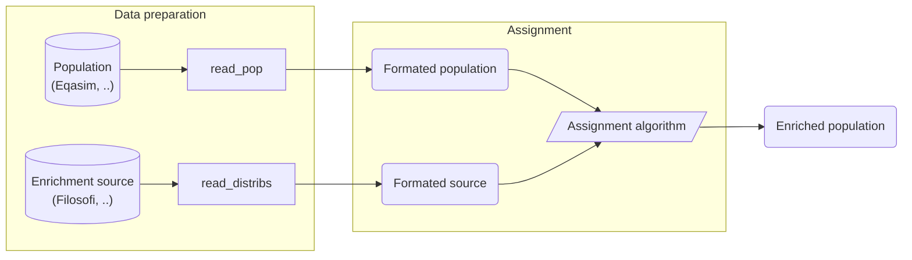

# Bhepop2

A common problem in **generating a representative synthetic population** is that not all attributes of interest are present in the sample.  The purpose is to enrich the synthetic population with additional attributes, after the synthetic population is generated from the original sample.

In many cases, practitioners only have access to aggregated data for important socio-demographic attributes, such as income, education level. 

This package treats the problem to **enrich an initial synthetic population from an aggregated data** provided in the form of a distribution like deciles or quartiles.



## Getting started

The Bhepop2 package is available on [PyPI](https://pypi.org/project/bhepop2/)

```bash
pip install bhepop2
```

## Example

See example notebooks [here](examples).

## Documentation

The documentation is hosted on ReadtheDocs : <https://bhepop2.readthedocs.io/en/latest/>

## Contributing

Feedback and contributions to Bhepop2 are very welcome, see [CONTRIBUTING.md](CONTRIBUTING.md) for more information !

## License

This project is licensed under the CeCILL-B License - see the [LICENSE.txt](LICENSE.txt) file for details

## Authors

This package is the product of the joint work of the Gustave Eiffel university and the company Tellae.

It was originally created as an implementation the Bhepop2
(Bayesian Heuristic to Enrich POPulation by EntroPy OPtimization) methodology. 
See the [bhepop2 module doc](https://bhepop2.readthedocs.io/en/latest/autoapi/bhepop2/enrichment/bhepop2/index.html) for more information.