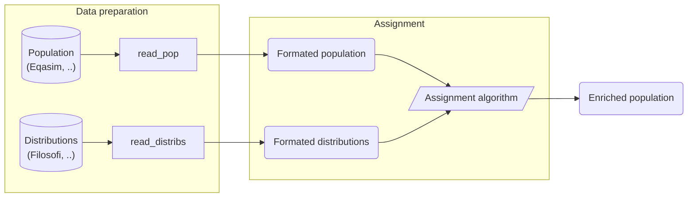

# synthetic-pop-uge-tellae

## Project goal

TODO : Explain
- project goal and contents
- how distributions are used to link information to the population
- distinction between variables and modalities

## Algorithm inputs

### Formatted population

This input data represents the **population to be enriched** using the algorithm.

It is a `DataFrame` containing one entry per population individual. The expected columns are the following:

- `{ id }`, an ID column (can be specified as a parameter)
- `commune_id`, the commune identifier to which the entry is associated
- one column for each attribute used by the algorithm. Entries contain the value (modality) of each attribute

TODO : maybe add example table

Source data for the formatted population can be _Eqasim_ population/households or any type of synthetic population.

### Formatted distributions

This input data represents the **information used by the algorithm to enrich the population**.

It is a `DataFrame` containing one entry per distribution. The expected columns are the following:

- `commune_id`, the commune identifier to which the distribution is associated
- `D1`; `D2`; ...; `D9`, deciles of the distribution
- `attribute`, name of the attribute associated to this distribution
- `modality`, name of the modality associated to this distribution

TODO : maybe add example table

> The values of the `attribute` column define the columns that must be present in the population data.
> 
> The values of the `modality` column define the possible values that can be taken by the corresponding attribute in
the population data.

Source data for the formatted distributions can be _INSEE_ databases (_Filosofi_, ..) or other demographic data sources.

## Util functions

This project also comes with functions to help you run it on common data.

### Eqasim

This project uses a format close to _Eqasim_'s for its population, which should facilitate
its use.

Some util functions are also provided for adding attributes and modalities values on an
_Eqasim_ population.

### Filosofi

This project was initially developed for enriching populations with _Filosofi_ income data,
so it contains functions for preparing this data at the expected format.