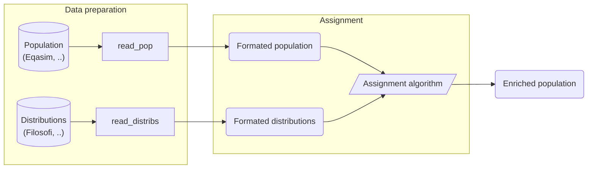

# The Bhepop2 package

A common problem in generating a representative synthetic population is that not all attributes of interest are present in the sample.  The purpose is to enrich the synthetic population with additional attributes, after the synthetic population is generated from the original sample.

In many cases, practitioners only have access to aggregate data for important socio-demographic attributes, such as income, education level. 

This package treats the problem to enrich an initial synthetic population with aggregate data given uner the form of a distribution like deciles or quartiles.

This package is based on a methodology called Bhepop2 (Bayesian Heuristic to Enrich POPulation by EntroPy OPtimization) and theoritically described, justified and discussed in 

* Boyam Fabrice Yaméogo, Pierre-Olivier Vandanjon, Pierre Hankach, Pascal Gastineau. Methodology for Adding a Variable to a Synthetic Population from Aggregate Data: Example of the Income Variable. 2021. ⟨hal-03282111⟩. Paper in review. 
 https://hal.archives-ouvertes.fr/hal-03282111

* Boyam Fabrice Yaméogo, Méthodologie de calibration d’un modèle multimodal des déplacements pour l’évaluation des externalités environnementales à partir de données ouvertes (open data) : le cas de l’aire urbaine de Nantes [Thèse], 2021
https://www.theses.fr/2021NANT4085

Vocabularies
* Attributes refer to  information in the initial sample or in the aggregate data as : age, profession, sex, etc. 
* Modalities are the partition of  one attribues : sex has in  our case study two modalities : female and male.
* Cross Modalities are the intersection of two or more modalities as : female and above 65 years old.
* Variable of interest are the degrees fo freedom of the opimization problem.
* Variables refer to the usuel meaning of variables in a computer program.

## Project goal

This package treats the problem to enrich an initial synthetic population with aggregate data given uner the form of a distribution like deciles or quartiles.  The sources of the algorithme are twofold :

* a synthesis population of households with socio-conomic attibutes : age, sex, tenant or owner, profession, etc.
* Aggregate data storing  the decile or quartiles for some modalities common with the synthesis population : the level of income is betweenn 1000 and 2000 euros for 10% of people under 30 years old, 

TODO : Explain
- project goal and contents
- how distributions are used to link information to the population
- distinction between variables and modalities

## Algorithm inputs

### Formatted population

This input data represents the **population to be enriched** using the algorithm.

It is a `DataFrame` containing one entry per population individual. The expected columns are the following:

- `{ id }`, an ID column (can be specified as a parameter)
- `commune_id`, the commune identifier to which the entry is associated
- one column for each attribute used by the algorithm. Entries contain the value (modality) of each attribute

| { id } | commune_id  | ownership |
|--------|-------------|-----------|
| 7865   | 44109       | Owner     |
| 1235   | 44109       | Tenant    |
| 4651   | 44109       | Tenant    |

Source data for the formatted population can be _Eqasim_ population/households or any type of synthetic population.

### Formatted distributions

This input data represents the **information used by the algorithm to enrich the population**.

It is a `DataFrame` containing one entry per distribution. The expected columns are the following:

- `commune_id`, the commune identifier to which the distribution is associated
- `D1`; `D2`; ...; `D9`, deciles of the distribution
- `attribute`, name of the attribute associated to this distribution
- `modality`, name of the modality associated to this distribution

| commune_id | D1     | ... | D9     | attribute | modality |
|------------|--------|-----|--------|-----------|----------|
| 44109      | 16 542 | ... | 50 060 | ownership | Owner    |
| 44109      | 8 764  | ... | 29 860 | ownership | Tenant   |

> The values of the `attribute` column define the columns that must be present in the population data.
> 
> The values of the `modality` column define the possible values that can be taken by the corresponding attribute in
> the population data.

Source data for the formatted distributions can be _INSEE_ databases (_Filosofi_, ..) or other demographic data sources.

## Util functions

This project also comes with functions to help you run it on common data.

### Eqasim

This project uses a format close to _Eqasim_'s for its population, which should facilitate
its use.

Some util functions are also provided for adding attributes and modalities values on an
_Eqasim_ population.

### Filosofi

This project was initially developed for enriching populations with _Filosofi_ income data,
so it contains functions for preparing this data at the expected format.
