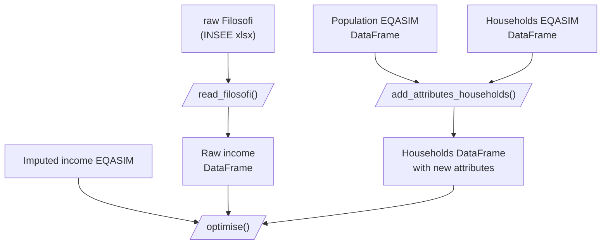

# synthetic-pop-uge-tellae

- `read_filosofi()` : TODO what is does, describe input data, describe output data
- `add_attributes_households()` : TODO what it does, describe input data, describe output data
- `optimise()`
