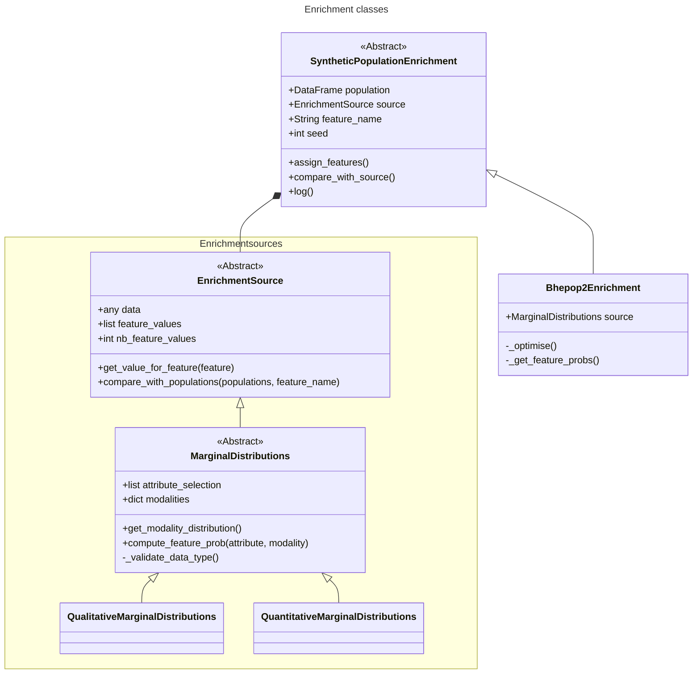

```mermaid
---
title: Enrichment classes
---
classDiagram
    SyntheticPopulationEnrichment <|-- Bhepop2Enrichment
    SyntheticPopulationEnrichment *-- EnrichmentSource
    EnrichmentSource <|-- MarginalDistributions
    MarginalDistributions <|-- QualitativeMarginalDistributions
    MarginalDistributions <|-- QuantitativeMarginalDistributions
    
    
    class SyntheticPopulationEnrichment{
        <<Abstract>>
        +DataFrame population
        +EnrichmentSource source
        +String feature_name
        +int seed
        +assign_features()
        +compare_with_source()
        +log()
    }

    class Bhepop2Enrichment{
        +MarginalDistributions source
        -_optimise()
        -_get_feature_probs()
    }

namespace Enrichment sources {

    class EnrichmentSource{
        <<Abstract>>
        +any data
        +list feature_values
        +int nb_feature_values
        +get_value_for_feature(feature)
        +compare_with_populations(populations, feature_name)
    }

    class MarginalDistributions{
        <<Abstract>>
        +list attribute_selection
        +dict modalities
        +get_modality_distribution()
        +compute_feature_prob(attribute, modality)
        -_validate_data_type()
    }

    class QualitativeMarginalDistributions{
        
    }

    class QuantitativeMarginalDistributions{
    
}
}
```